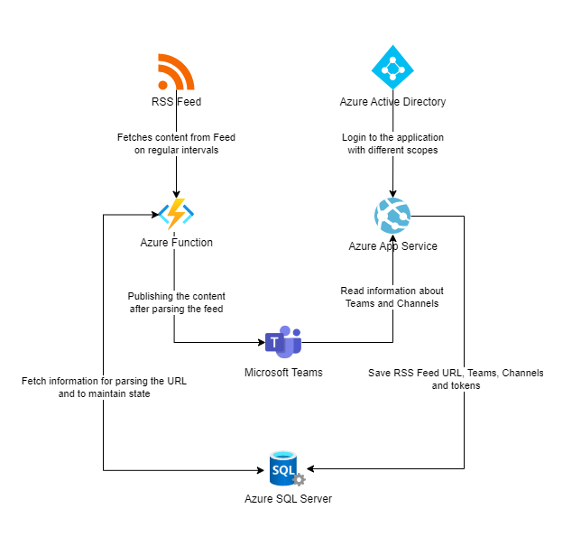
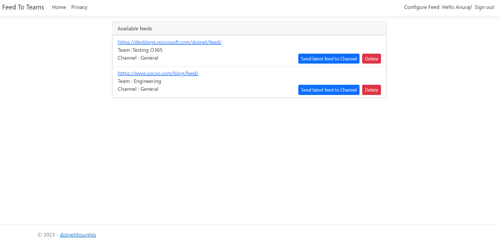
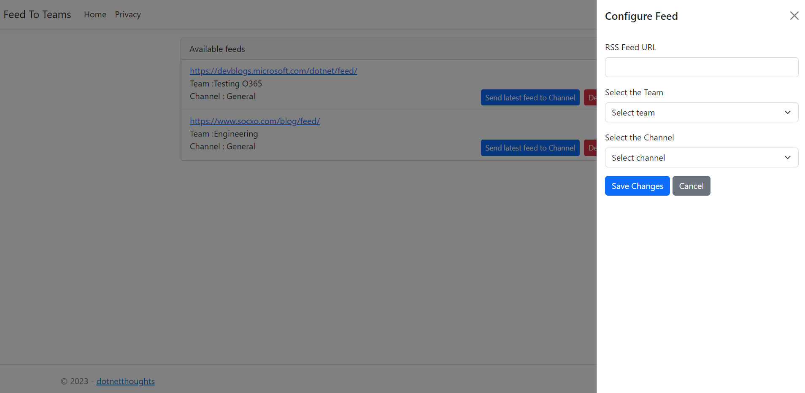
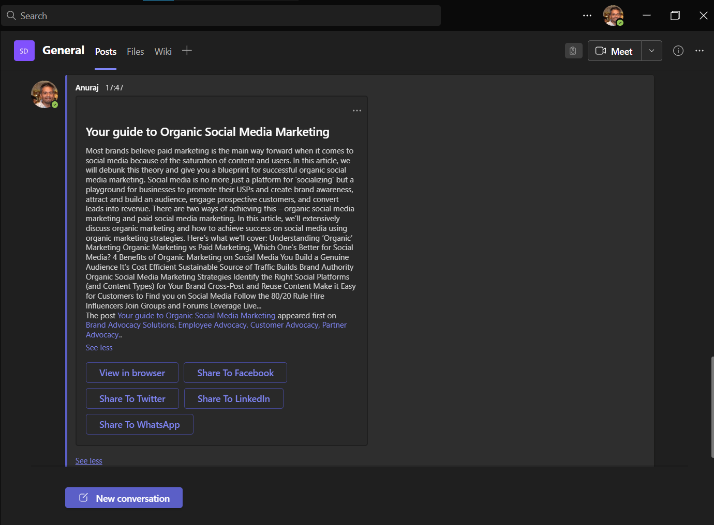

# Feed to Teams

[![Hack Together: Microsoft Graph and .NET][badge_hackathon]][link_hackathon]
[![github issues][badge_issues]][link_issues]
[![github stars][badge_repo_stars]][link_repo]
[![Language][badge_language]][link_repo]
[![License][badge_license]][link_repo]

Employee advocacy is the practice of empowering and encouraging employees to share positive and authentic content about their employer on social media, in personal conversations, or through other means of communication, to promote the company's brand, products, and services.

This is an employee advocacy solution that enables companies to amplify their blog content via Microsoft Teams to employees, customers, and stakeholders and help them to share on social media. It's a user-friendly tool designed to help organizations increase their brand visibility.

## Technical Stack

* ASP.NET Core 6.0
* C#
* Graph SDK
* Azure Function - Timer triggered.
* SQL Server

## Architecture

## How it works

By logging into the ASP.NET Core web application, administrators can configure their website's RSS feed to specific teams and channels. At regular intervals, the Azure function is activated, parses the RSS feed and it delivers the most recent content to the designated team channels with share buttons.

## Screenshots

#### Dashboard

#### Configuring a Feed

#### Latest blog entry in Teams

## Improvements
* Option to see the analytics.
* Option to configure UTM parameters, which helps to identify the improvements by the employee advocacy program.
* Include Open Graph image as thumbnail.

## Supporting this project
As many developers know, projects like this are built in spare time! If you find this project useful, please :star2: star the repo.

## About the author

[![Checkout my blog][badge_blog]][link_blog]
[![LinkedIn Profile][badge_linkedin]][link_linkedin]
[![Follow me on Twitter][badge_twitter]][link_twitter]

[badge_language]: https://img.shields.io/badge/language-C%23-blue?style=for-the-badge
[badge_license]: https://img.shields.io/github/license/anuraj/feed-to-teams?style=for-the-badge
[badge_issues]: https://img.shields.io/github/issues/anuraj/feed-to-teams?style=for-the-badge
[badge_repo_stars]: https://img.shields.io/github/stars/anuraj/feed-to-teams?logo=github&style=for-the-badge

[badge_hackathon]: https://img.shields.io/badge/Microsoft%20-Hack--Together-orange?style=for-the-badge&logo=microsoft

[link_issues]: https://github.com/anuraj/feed-to-teams/issues
[link_repo]: https://github.com/anuraj/feed-to-teams
[link_hackathon]: https://github.com/microsoft/hack-together

[badge_blog]: https://img.shields.io/badge/blog-dotnetthoughts.net-blue?style=for-the-badge
[badge_linkedin]: https://img.shields.io/badge/LinkedIn-anurajp-blue?style=for-the-badge&logo=linkedin
[badge_twitter]: https://img.shields.io/badge/follow-%40anuraj-1DA1F2?logo=twitter&style=for-the-badge&logoColor=white
[link_blog]: https://dotnetthoughts.net/
[link_linkedin]: https://www.linkedin.com/in/anurajp/
[link_twitter]: https://twitter.com/anuraj
